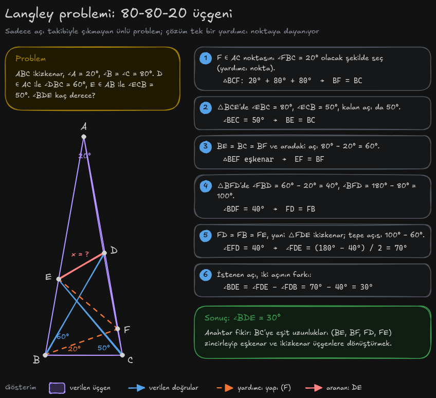
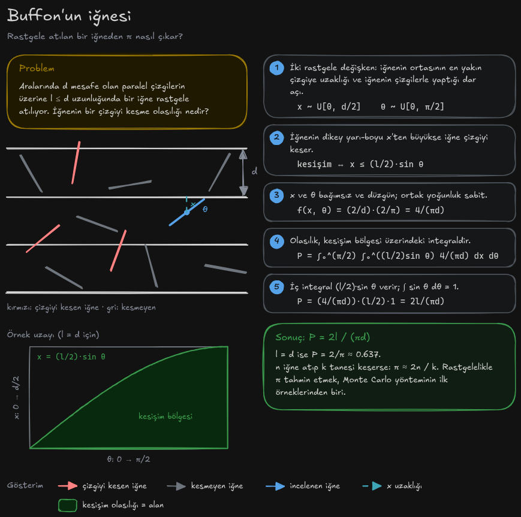
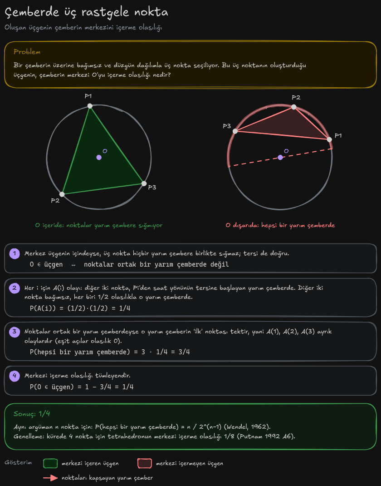
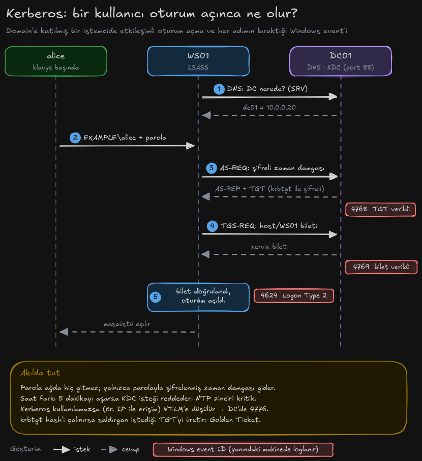
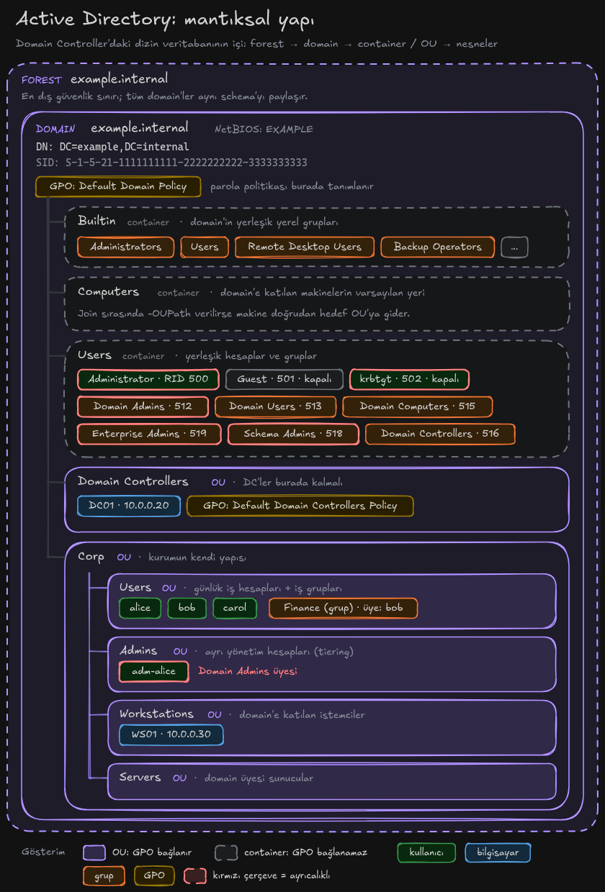
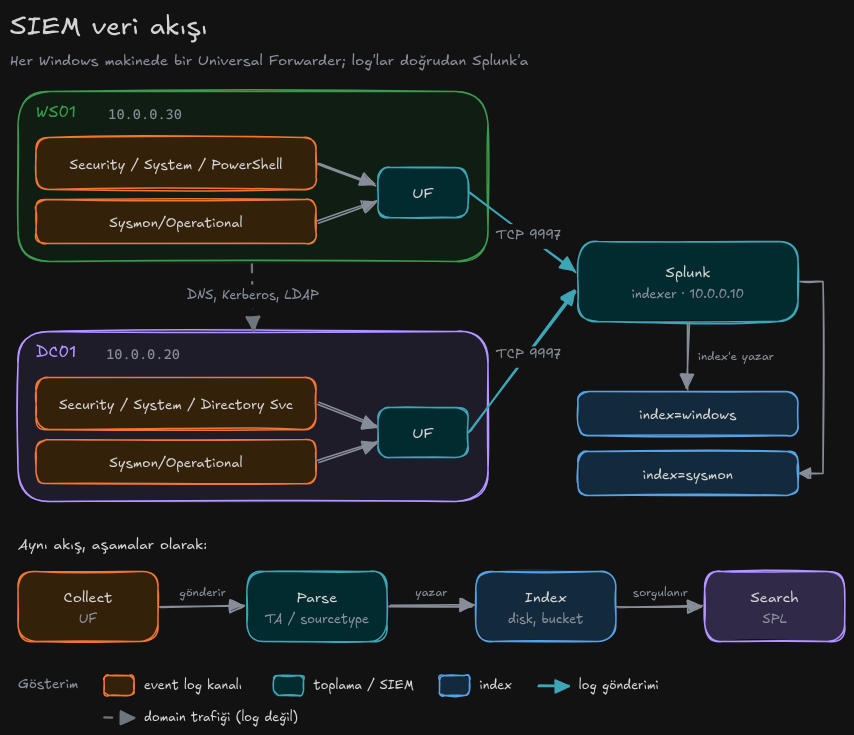

# excalidraw-diagram-kit

Python'dan **Excalidraw çizimleri** üretmek, onları gerçek Excalidraw motoruyla **PNG'ye render edip kontrol etmek**
ve bunu **Claude Code**'a her konuda "şunu çiz" diyerek yaptırmak için küçük bir kit.

- `exdraw/` — Python kütüphanesi: kutu, etiket, ok, gösterim (legend), akış, sequence, adım adım çözüm kalıpları.
- `exdraw/render.py` — `.excalidraw` / Obsidian `.excalidraw.md` dosyalarını headless Chrome'da render eder.
- `skills/excalidraw-diagrams/` — Claude Code skill'i: iş akışı, stil kuralları, renk anlamları.
- `examples/` — hiyerarşi, protokol akışı, veri akışı ve üç zor matematik probleminin çözümü.

## Örnekler

| | |
|---|---|
|  |  |
| **Langley problemi** — 80-80-20 üçgeninde yardımcı noktayla ∠BDE = 30° | **Buffon'un iğnesi** — kesişim olasılığı 2l/(πd) |
|  |  |
| **Çemberde üç nokta** — merkezi içerme olasılığı 1/4 | **Kerberos oturum açma** — adımlar ve Windows event'leri |
|  |  |
| **Active Directory yapısı** — iç içe container / OU ağacı | **SIEM veri akışı** — gruplu kutular ve etiketli akışlar |

Her örneğin kaynak script'i `examples/`, Excalidraw dosyası `examples/output/` altında (excalidraw.com'da açılır).

## Kurulum

Gereksinimler: Python 3.10+ ve Pillow; render için Node 22+, Chrome/Chromium ve internet (Excalidraw esm.sh'den yüklenir).

```bash
git clone git@github.com:Eraybeylik/excalidraw-diagram-kit.git ~/Projects/excalidraw-diagram-kit
cd ~/Projects/excalidraw-diagram-kit
./install.sh        # skill'i ~/.claude/skills/excalidraw-diagrams olarak bağlar, gereksinimleri kontrol eder
```

Kurulumdan sonra Claude Code'da herhangi bir projede "bunu çiz", "şu mimariyi diyagram yap",
"şu problemi Excalidraw'da çöz" demen yeterli. Skill kütüphaneyi, stil kurallarını ve render-kontrol
döngüsünü kendisi kullanır.

## Elle kullanım

```python
from exdraw import Scene, flow, BLUE, TEAL, ORANGE, MUTED

s = Scene("Log pipeline", "Veri bir SIEM'de nasıl akar?")
flow(s, 32, 110, [("Collect", ["UF, HEC"], ORANGE), ("Index", ["bucket"], TEAL), ("Search", ["SPL"], BLUE)],
     ["gönderir", "sorgulanır"])
s.legend(32, 230, [("arrow", MUTED, "veri akışı")], title="Gösterim")
s.save("pipeline.excalidraw")          # Obsidian için: "pipeline.excalidraw.md"
```

```bash
PYTHONPATH=. python3 my_diagram.py
python3 -m exdraw.render pipeline.excalidraw -o previews/     # previews/pipeline.png
python3 examples/build_all.py --render                          # tüm örnekler + docs/previews
```

## Nasıl çalışır?

1. **Excalidraw dosyası bir şekil listesidir.** Her kutu, yazı ve ok; konumu, boyutu ve renkleriyle JSON'da
   bir elemandır. Obsidian eklentisi aynı JSON'u bir Markdown dosyasının içinde saklar.
2. **`Scene` bu listeyi üretir.** `chip("alice", GREEN)` gibi bir çağrı, yazının genişliğini gerçek bir fontla
   ölçer (`Excalifont` için 1.12 ile ölçekler), kutuyu ona göre boyutlandırır ve iki eleman ekler.
3. **Renkler.** Palet Excalidraw'ın açık tema renkleridir; sahne koyu temayla kaydedilir, Excalidraw ekranda
   renkleri ters çevirir. Her renk her çizimde aynı anlamı taşır (skill'deki tabloya bak).
4. **Kontrol döngüsü.** `exdraw.render`, sahneyi yerel bir sayfada Excalidraw'ın resmi `exportToSvg`
   fonksiyonuyla çizer; Chrome DevTools Protocol ile çizimin bittiğini bekler ve sadece çizimi PNG olarak
   keser. PNG'ye bakılır, taşma ya da çakışma varsa koordinat düzeltilip tekrar üretilir.
5. **Stil kuralları** (C4 model'den): her çizimde başlık ve gösterim, her okta ne yaptığını söyleyen etiket,
   tutarlı renk anlamı, anlamın yalnızca renge bağlı olmaması.

## Notlar

- Obsidian'da bir çizimi elle düzenlersen eklenti dosyayı sıkıştırır (`compressed-json`). O dosyayı
  script'le yeniden üretmek elle yaptığın değişiklikleri siler. Render aracı sıkıştırılmış dosyaları da okur.
- Aynı başlık → aynı rastgele tohum → birebir aynı çıktı; yeniden üretince git diff'i temiz kalır.

## Test

```bash
uv run --no-project --with pillow --with pytest pytest -q
```
